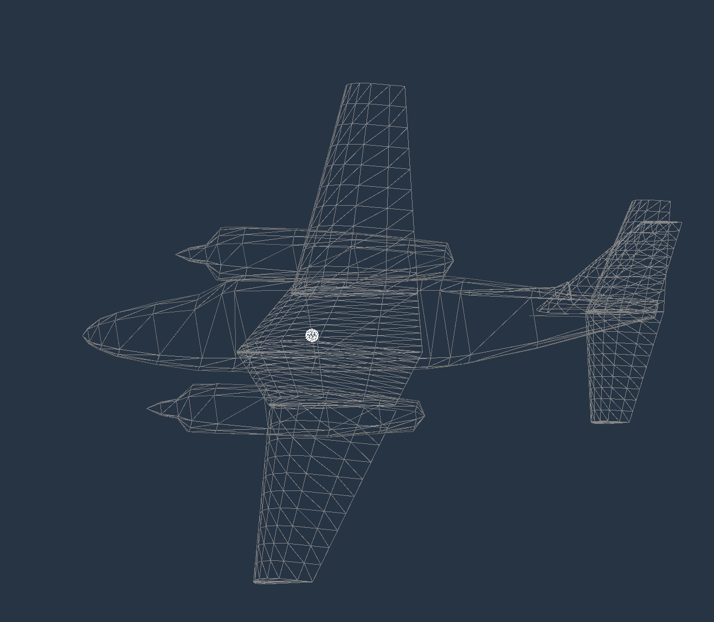
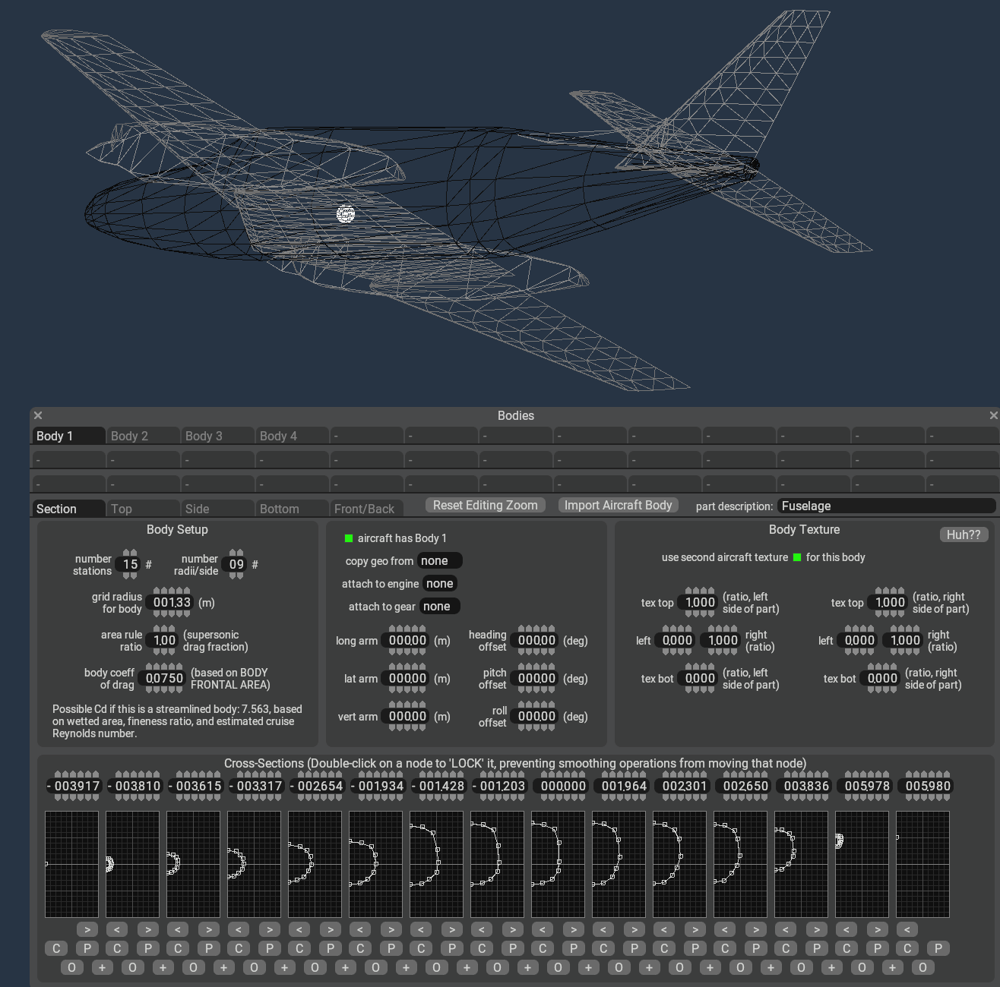
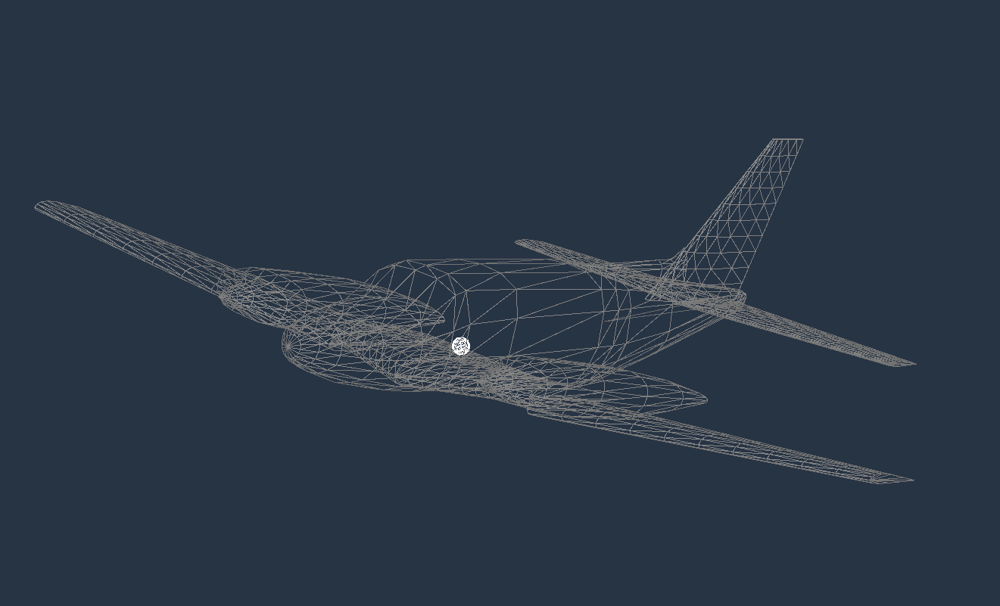
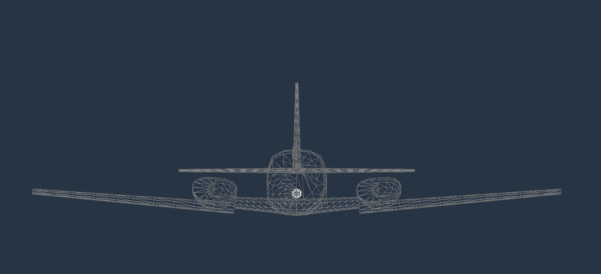
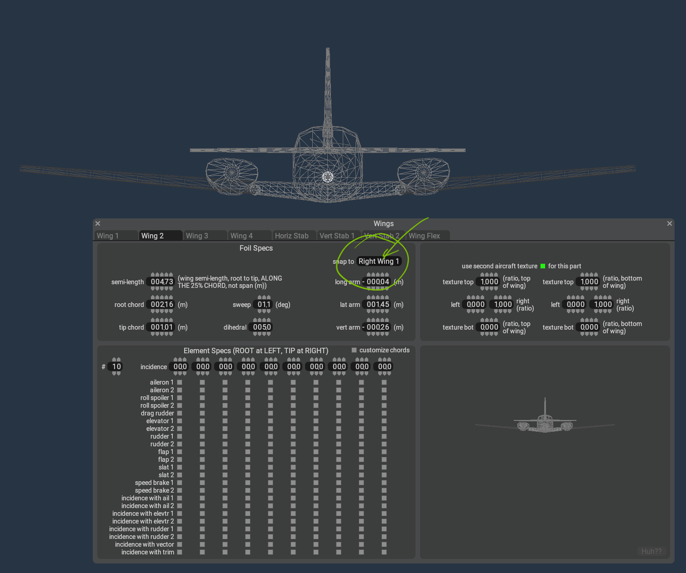
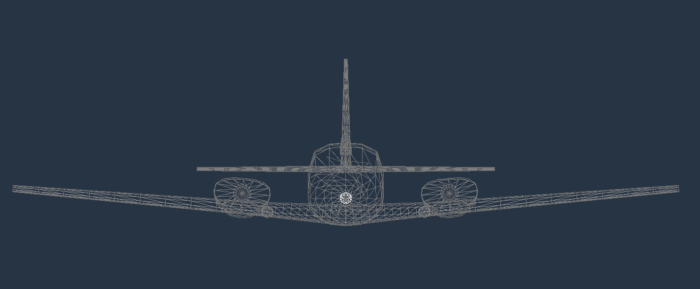
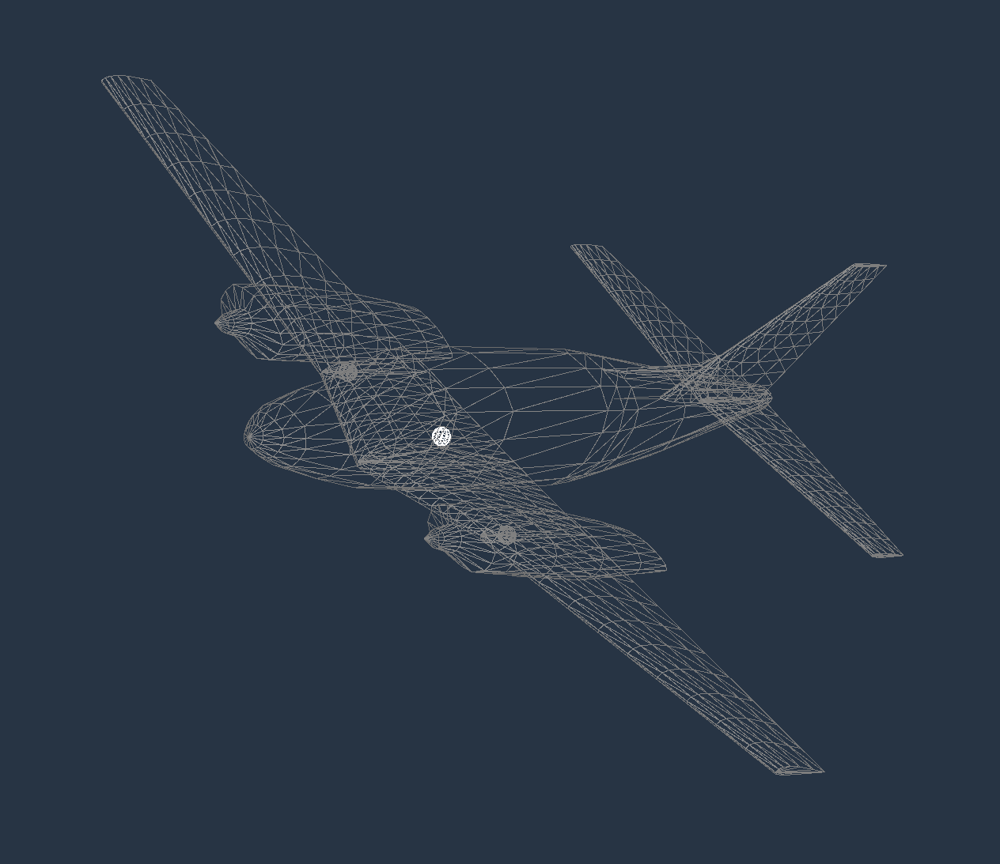
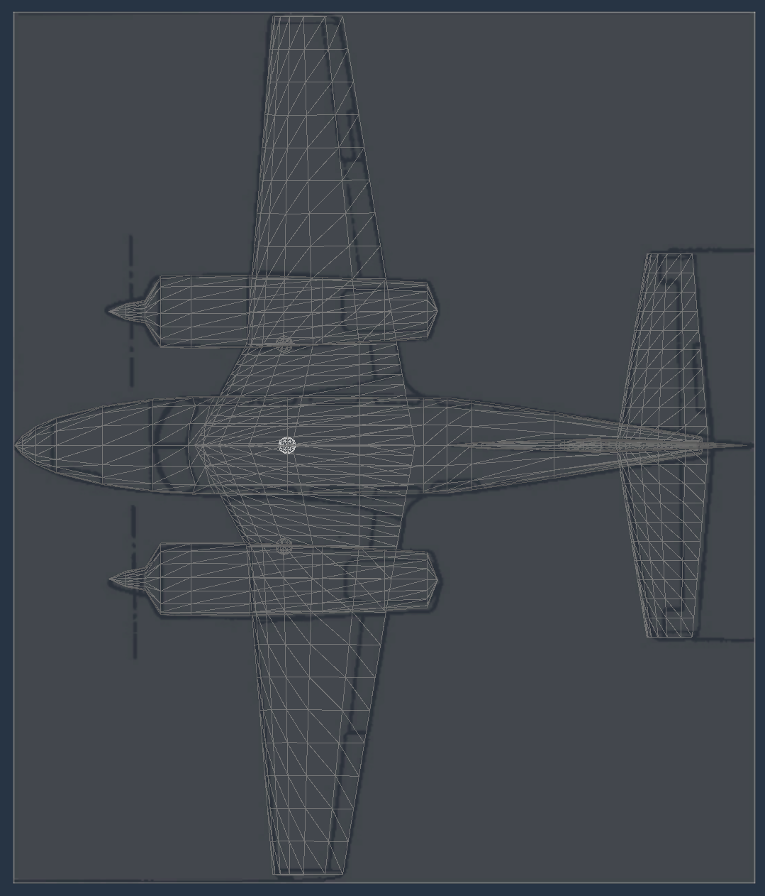
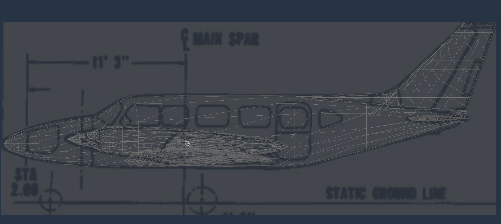

## Blender Guidelines to create the 3d flight model and Importing the generated .acf file in Plane Maker.

There are two main object categories.

Bodies and Wings.

### 1 - Bodies

Fuselage, cowling, fairings, etc are considered bodies for PM.  Name your bodies correctly
Fuselage,  LF_Cowling, RT_Cowling, Faring_tail, Fairing_wings, etc.
- Every body needs to have the following charateristics:
- 1 vertex at the nose/tip and 1 vertex at the end.
- The inner rings between the nose and tail should have between 8 and 16 vertices.

### 2 - Wings

Wings, horizontal and vertical stab are considered wings.
- Wings are built from single planes.  Each wing should have only 4 vertices, depicting the x section of the each one of the wings.
- Naming is important.  The main wing should be named Wing1, the wing when it changes geometry as the illustration shows, should be named Wing2.
- Horizontal Stabilator, should be named horizontal_stab.
- Vertical Stabilator, should be named vert_stab.

The app will caculate the wing parameters for Plane Maker from this planes.

Look at the top and side views for reference.    

Orthographic view for the wings elements.

### 3 - Exporting

Once you are done with the modeling of the bodies and the wings reference planes, select all your objects and export them as an .obj wavefront format file.

Use the following setting to export your .obj file

###  - Read the CIS_FlightModelGenerator_Documentationl.md on how to use the bridge to transform your exported .obj wavefront file to an .acf file to be used in Plane Maker.

### 4 - Importing in Plane Maker

Open your created .acf file in Plane Maker.

You will need to make small adjustments for PM to recalculate the bodies and attach wing2 to wing1 properly.

1. At first you will some oddness to the bodies geometry.  As if only one half_side was generated.  This is normal as Plane Maker will rebuild the geometry from the imported .acf

2. Open the Bodies tab and just click the different bodies tabs.

3. Plane Maker will recalculate the bodies and the 3d mesh for the bodies will be displayed correctly.

4. Fixing the wings2 position

As you can see when you import the recentely created .acf file your main wing will have an offset where it attaches to the main wing1.
Note: If you only have one main wing, this is not needed.

Open the wings options.  Select the wing2 and attach it to the wing1.  Go to the SNAP TO dropdown menu and select wing1.  Double click.
The wing2 will move into place.

Now thw wings are aligned correctly.

After this single steps, your bodies and wings are now recalculated by PM.

5. Check your imported .acf against your blueprints reference you used to model the 3d aircraft flight model geometry.

Your 3d Flight Model is ready to continue work on assigning the control surfaces to the wings.  Flaps, ailerons, elevator, rudders, etc.

** Note:
It is important that before you start working on the control surfaces of the wings, you are satisfied with the wings.  If you assign this parameters and you want to make changes to the wings geometry.  This values will be overwritten when you create the wings again.